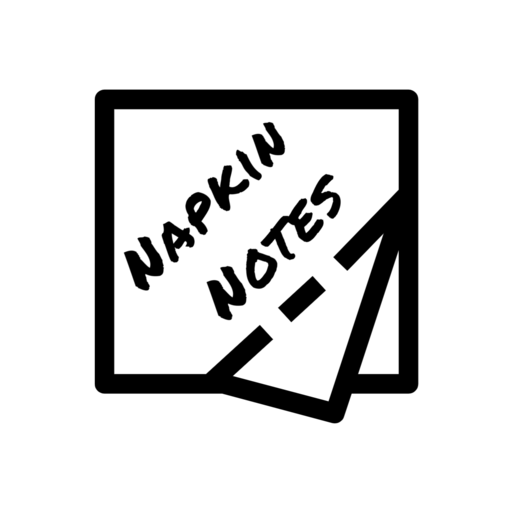
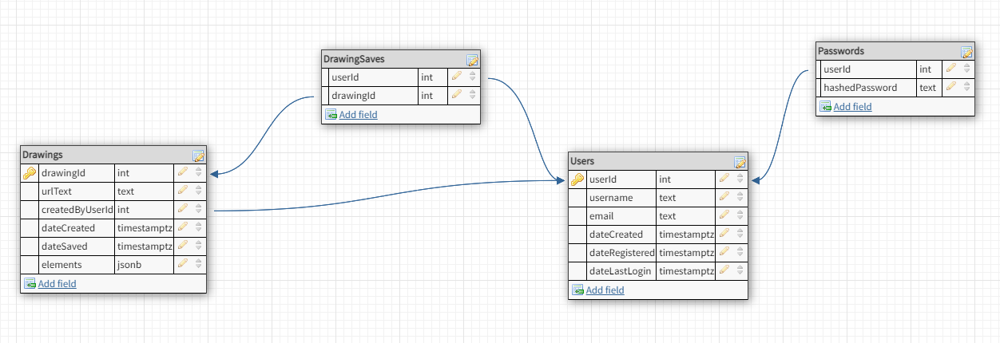

  

# NapkinNotes

A web application for coders who want to illustrate code ideas.

## Why I Built This

When either teaching or learning how to code, inevitably an idea needs to be drawn out to be fully communicated. Drawing on the whiteboard can be really helpful, but handwritten code can be hard to read.

To fix this, I made a tool that allows users to draw as they would on a whiteboard and also add Markdown with syntax highlighted code so that they can illustrate their ideas on top of code that is easy to read.

Inspired by [witeboard](https://witeboard.com/d11c7ad0-251c-11ed-9750-23d1f6f20425) and Figma's [FigJam](https://www.figma.com/figjam/).

## Live Demo

Try the application out: [Heroku Deployment](https://napkinnotes.herokuapp.com)

## Technologies Used

### Front-End

* UI Framework: **React**

* CSS Framework: **Bulma**
* Markdown Rendering: **Marked**, **DOMPurify**
* Syntax Highlighting: **Prism**
* Notifications: **Toastify**

### Back-End

* Node.js
* Express
* Database: **PostgreSQL**

### Tools

* Webpack
* Heroku

### Languages

* HTML5
* CSS3
* JavaScript (ES6)

## Database Schema

## Features
* Draw with a pen
* Write text
* Write Markdown and have it rendered

## Preview

## Features In Development
* User accounts with the ability to save drawings
* Opening previous drawings to continue editing
* Collaborating with others on the same canvas

## Development

### System Requirements

### Getting Started
