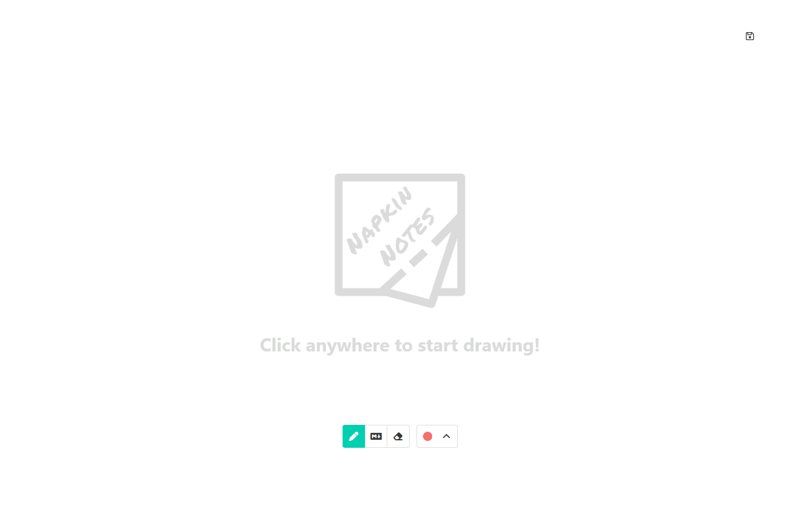
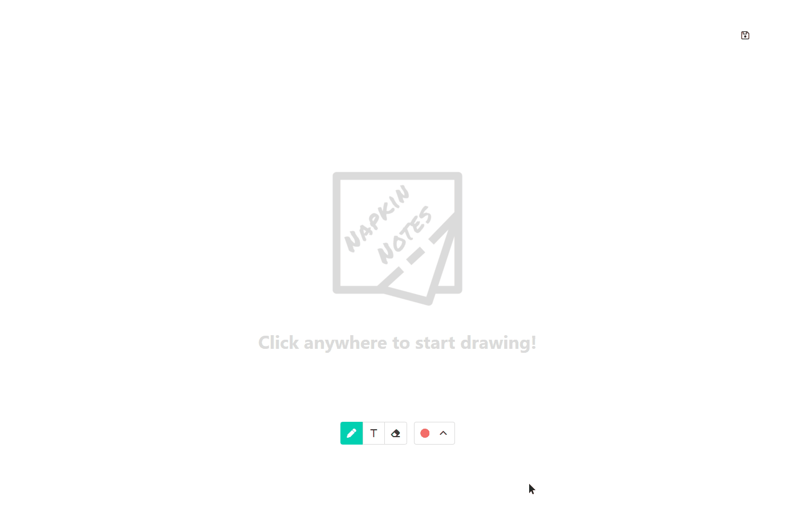

<p align="center">
  
</p>

# NapkinNotes

A web application for coders who want to illustrate code ideas.

## Why I Built This

Oftentimes, the best way to explain a coding concept is to draw it out on a whiteboard. From my own observations, however, handwritten code has a few key shortcomings:

* Handwriting is not always legible
* Inserting lines between what has already been written creates a cluttered mess
* Code is not syntactically highlighted so elements of code are harder to distinguish

To overcome these, I made NapkinNotes! Like jotting down something quickly on the back of a napkin, NapkinNotes provides you a canvas and a pen to sketch out your ideas. To tackle the problems of handwritten code, there is also a Markdown tool where you can add Markdown code anywhere on the canvas and it will be rendered as HTML with code snippets syntax highlighted. Now you can add neat and legible code while being able to draw all over it!

---

This project was inspired by [witeboard](https://witeboard.com/d11c7ad0-251c-11ed-9750-23d1f6f20425) and Figma's [FigJam](https://www.figma.com/figjam/).


##  Live Demo

Try NapkinNotes out here: [Heroku Deployment](https://napkinnotes.herokuapp.com)

## Technologies Used

### Front-End

* UI Framework: **React**
* CSS Framework: **Bulma**
* Markdown Rendering: **Marked**, **DOMPurify**
* Syntax Highlighting: **Prism**
* Notifications: **Toastify**

### Back-End

* JavaScript Runtime: **Node.js**
* Server Framework: **Express**
* Database: **PostgreSQL**

### Miscellaneous Tools

* Module Bundler: **Webpack**
* Deployment Platform: **Heroku**

### Languages

* HTML5
* CSS3
* JavaScript (ES6)
* SQL

## Database Schema


## Features

* Users can draw with a pen
* Users can write plain text
* Users can choose a color
* Users can write Markdown and have it rendered in HTML
* Users can write Markdown code snippets and have syntax highlighting (when a supported language is specified)
* Users can erase what they have added to the canvas

## Preview

### Drawing



### Markdown



## Features In Development

* User accounts with the ability to save drawings
* Opening previous drawings to continue editing
* Collaborating with others on the same canvas

## Development

### System Requirements

* Node (v18.3.0+)
* NPM (v8.11.0+)
* PostgreSQL (v14.3+)

### Getting Started

1. Clone this repository and move into the directory.

    ```shell
    git clone https://github.com/dennisliu9/final-project
    cd napkin-notes
    ```

1. Install dependencies in `package.json` with NPM.

    ```shell
    npm install
    ```

1. Create a `.env` file from the `.env.example` template.

    ```shell
    cp .env.example .env
    ```

1. Update the `TOKEN_SECRET` value with anything you want.

1. Start up PostgreSQL and create the database (if necessary).

    ```shell
    sudo service postgresql start
    createdb nameOfDatabase
    ```

1. Update the `DATABASE_URL` to point to your PostgreSQL database. (Change `changeMe` to the name of your database in the previous step.)

1. Initialize the database. (🚨🚨🚨 Warning! This will drop everything in `public` schema! Make sure you have the right database in the `DATABASE_URL`!)

    ```shell
    npm run db:import
    ```

1. Start up the application. It should be viewable in your browser at `http://localhost:3000`.

    ```shell
    npm run dev
    ```
